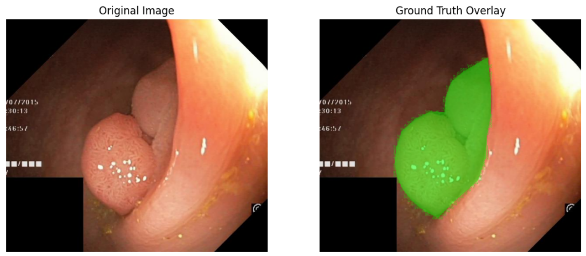
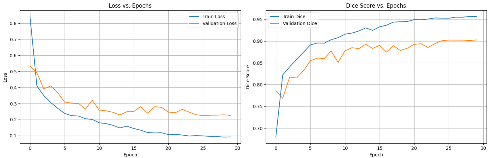
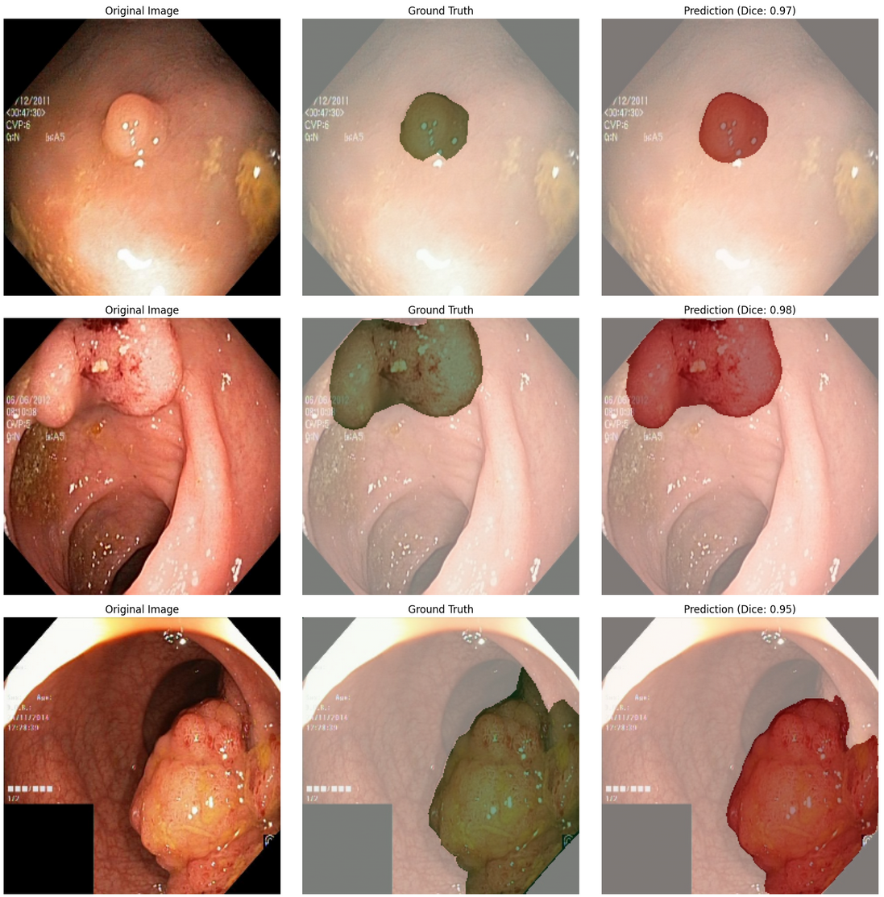

# 🩺 Colonoscopy Polyp Segmentation using U-Net++ and PyTorch

This project implements a **deep learning pipeline** to automatically **segment polyps from colonoscopy images**.  
It leverages the **U-Net++** architecture with a pre-trained **EfficientNet-B3** encoder, built using PyTorch and the `segmentation-models-pytorch` library.

---

## 📑 Table of Contents
- [Project Description](#-project-description)
- [Dataset](#-dataset)
- [Key Technologies](#-key-technologies)
- [Model Architecture](#-model-architecture)
- [Usage Workflow](#-usage-workflow)
- [Results](#-results)

---

## 🧾 Project Description

Colorectal cancer is one of the leading causes of cancer-related deaths. **Polyps**, as precursors, play a critical role in early detection and prevention.  
The goal of this project is to build a **robust segmentation model** for polyp identification, helping medical professionals detect anomalies more efficiently.  

The full pipeline — from **data loading and augmentation to training, evaluation, and visualization** — is documented in the notebook:  
📓 `Colonoscopy Polyp Segmentation.ipynb`

---

## 📂 Dataset

This project uses the **[Kvasir-SEG](https://datasets.simula.no/kvasir-seg/)** dataset:  
- **1000 colonoscopy images** with corresponding **segmentation masks**  
- Additional metadata (bounding boxes) in a JSON file  

**Sample Data**  

---

## 🛠️ Key Technologies

- **Deep Learning**: `PyTorch`, `segmentation-models-pytorch`  
- **Architecture**: U-Net++ with EfficientNet-B3 backbone  
- **Augmentation**: `Albumentations`  
- **Data Handling**: `pandas`, `NumPy`  
- **Visualization**: `matplotlib`  
- **Utilities**: `scikit-learn`, `tqdm`  

---

## 🏗️ Model Architecture

The model is based on **U-Net++**, an advanced U-Net with **nested and dense skip connections** for finer feature extraction.  
It uses a **pre-trained EfficientNet-B3 encoder** to benefit from transfer learning.  

🔧 **Training Details**:  
- **Loss Function**: BCE + Dice Loss  
- **Optimizer**: Adam  
- **Scheduler**: CosineAnnealingLR  

---

## ⚙️ Usage Workflow

The workflow inside `Colonoscopy Polyp Segmentation.ipynb` includes:

1. **Import Dependencies**  
2. **Load Metadata** → from `kvasir_bboxes.json`  
3. **Visualize Data** → images & masks  
4. **Split Dataset** → train (70%) / val (15%) / test (15%)  
5. **Prepare Data Pipeline** → custom Dataset, Albumentations, DataLoaders  
6. **Define Model** → U-Net++ with EfficientNet-B3 encoder  
7. **Configure Training** → loss, optimizer, scheduler  
8. **Run Training** → train for multiple epochs, save best model  
9. **Evaluate Performance** → plot training/validation curves  
10. **Test Model** → evaluate on unseen test set  
11. **Visualize Predictions** → compare input, ground truth, and predictions  

---

## 📊 Results

After **30 epochs**, the model achieved:

- **Final Test Dice Score**: 🎯 **0.92**  
- **Final Test Loss**: 📉 **0.16**

**Training History**  

**Sample Predictions**  

